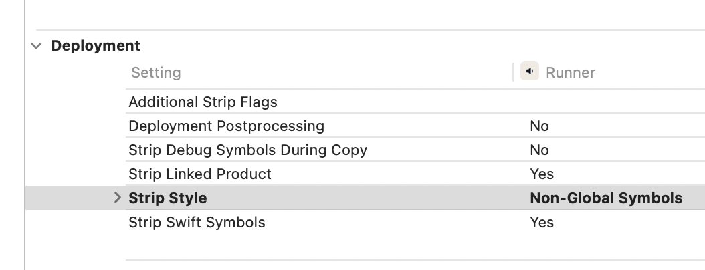

# nosmai_agora_bridge

Seamless integration of **Nosmai filters** with **Agora RTC Engine** for Flutter. Apply real-time video filters to your Agora streams **without writing any native code**.

## Features

- **Zero Native Code** - All platform-specific code is handled internally
- **Cross-Platform** - Works on Android and iOS
- **Minimal Integration** - Add Nosmai filters to existing Agora apps with just 2 lines
- **Full Control** - Manage your RtcEngine configuration as usual
- **High Performance** - Optimized video frame processing pipeline

## Problem Solved

Integrating Nosmai filters with Agora typically requires:
- Writing native code in Kotlin/Java (Android)
- Writing native code in Objective-C/Swift (iOS)
- Understanding video frame processing pipelines
- Managing native handles and memory

**This package eliminates all of that.**

## Installation

Add to your `pubspec.yaml`:

```yaml
dependencies:
  nosmai_agora_bridge:
    git:
      url: https://github.com/nosmai/nosmai_agora_bridge.git

  agora_rtc_engine: ^x.x.x
  nosmai_camera_sdk: ^x.x.x
```

Run:
```bash
flutter pub get
```

## Usage

### Order matters

Two rules cause almost every "the bridge doesn't work" report. Both fail
*silently* — the app runs, the stream connects, and the result is simply wrong.

**1. `getNativeHandle()` must run BEFORE `NosmaiFlutter.initialize()`.**

`getNativeHandle` creates Agora's engine and stashes its EGL context as the
share context. Nosmai's GL context has to be created *after* that so it joins
the same share group. Initialize Nosmai first and its textures are invisible to
Agora's encoder — **the remote side shows black** while local preview looks
perfect.

**2. Publish with `NosmaiAgoraBridge.startStreaming()`, not
`rtcEngine.joinChannel()`.**

`startStreaming` joins the channel *and* switches Agora to the Nosmai-supplied
texture. Calling `joinChannel` directly publishes Agora's **own raw camera** —
the stream works and shows your face, but **no filter is ever visible remotely**.

### 1. Get the native handle (FIRST)

```dart
import 'package:nosmai_agora_bridge/nosmai_agora_bridge.dart';

final nativeHandle = await NosmaiAgoraBridge.getNativeHandle(
  agoraAppId: 'YOUR_AGORA_APP_ID',
);
```

### 2. Initialize Nosmai (AFTER the handle)

```dart
import 'package:nosmai_camera_sdk/nosmai_camera_sdk.dart';

// Licence keys are platform-specific and bound to your bundle id.
await NosmaiFlutter.initialize(
  Platform.isIOS ? 'YOUR_NOSMAI_IOS_KEY' : 'YOUR_NOSMAI_ANDROID_KEY',
);
```

### 3. Create and configure the Agora engine

```dart
_engine = createAgoraRtcEngine(sharedNativeHandle: nativeHandle);

await _engine.initialize(RtcEngineContext(
  appId: 'YOUR_AGORA_APP_ID',
  channelProfile: ChannelProfileType.channelProfileLiveBroadcasting,
));

await _engine.enableVideo();

// NO startPreview(). Nosmai owns the camera in this model — see step 5.
```

### 4. Start streaming through the bridge

```dart
final ok = await NosmaiAgoraBridge.startStreaming(
  channelName: 'YOUR_CHANNEL',
  // null, not '' — omit entirely for a project with no certificate.
  token: (token != null && token.isNotEmpty) ? token : null,
  uid: 0,
);
```

### 5. Show the local preview

Use **Nosmai's** preview widget, not `AgoraVideoView`:

```dart
const NosmaiCameraPreview()
```

Nosmai owns the camera, so `AgoraVideoView(canvas: VideoCanvas(uid: 0))` renders
Agora's own capture — the *unfiltered* camera, or nothing at all. The filtered
frames only exist inside Nosmai's pipeline.

### 6. Apply filters

```dart
final filters = await NosmaiFlutter.instance.getLocalFilters();

// applyFilter handles BOTH shader filters and AR effects — the SDK routes on
// the package's manifest type, so there is no separate applyEffect call.
await NosmaiFlutter.instance.applyFilter(filters[0].path);

await NosmaiFlutter.instance.removeAllFilters();
```

Filters can be applied and swapped **while streaming**; remote viewers see the
change immediately.

> **Bundling filter assets:** declare **one pubspec entry per filter directory**.
> Flutter does not recurse into subdirectories, so a single
> `- assets/nosmai_filters/` line bundles nothing and `getLocalFilters()`
> returns an empty list with no error.

### 7. Switch camera

```dart
// Through NOSMAI, not _engine.switchCamera() — Nosmai owns the camera, so the
// Agora call would flip a capture device that is not being published.
await NosmaiFlutter.instance.switchCamera();
await NosmaiAgoraBridge.notifyCameraSwitch();
```

### 8. Cleanup

```dart
// stopStreaming FIRST: the bridge owns channel membership and must release its
// texture helper before the engine goes away. The other order leaves the helper
// holding a share-group reference to a dead engine — this is the cause of the
// "second go-live freezes, then goes black" failure.
await NosmaiAgoraBridge.stopStreaming();
await _engine.leaveChannel();
await _engine.release();
await NosmaiAgoraBridge.disposeNative();
```

### Android setup

The camera SDK's native AAR is declared `compileOnly`, so **your app must supply
it**. Download it from
[camera-sdk-android releases](https://github.com/nosmai/camera-sdk-android/releases)
and place it at `android/app/libs/nosmai-release.aar` (that exact filename is
what the plugin resolves), then:

```kotlin
// android/build.gradle.kts
allprojects {
    repositories {
        flatDir { dirs(rootProject.projectDir.resolve("app/libs")) }
    }
}

// android/app/build.gradle.kts — compileOnly means it is NOT packaged;
// without this the app builds and then dies on the first native call.
dependencies {
    implementation(files("libs/nosmai-release.aar"))
}
```

## Complete Example

A full, working implementation lives in [`example/lib/main.dart`](example/lib/main.dart)
— streaming, a live filter picker, camera switch and teardown, all in the order
described above.

Deliberately **not** duplicated here: an inline copy drifts from the real code,
and the previous version of this README taught the reversed init order and a
direct `joinChannel` call, both of which silently break filtering.

To run it:

1. Add your credentials at the top of `example/lib/main.dart`
   (`_appId`, `_channelName`, `_nosmaiKey`).
2. Drop the SDK AAR at `example/android/app/libs/nosmai-release.aar`
   (see [Android setup](#android-setup)).
3. Optionally add `.nosmai` packages under
   `example/assets/nosmai_filters/<name>/` and uncomment the matching lines in
   `example/pubspec.yaml`.
4. `flutter run`

## Applying Filters

### Local Filters

```dart
final filters = await NosmaiFlutter.instance.getLocalFilters();
await NosmaiFlutter.instance.applyFilter(filters[0].path);
```

### Cloud Filters

```dart
final cloudFilters = await NosmaiFlutter.instance.getCloudFilters();
final result = await NosmaiFlutter.instance.downloadCloudFilter(cloudFilters[0].id);
await NosmaiFlutter.instance.applyFilter(result['path']);
```

### Beauty Filters

```dart
await NosmaiFlutter.instance.applySkinSmoothing(5.0);
await NosmaiFlutter.instance.applyFaceSlimming(3.0);
await NosmaiFlutter.instance.applyEyeEnlargement(2.0);
await NosmaiFlutter.instance.removeAllFilters();
```

## How It Works

```
┌─────────────────────────────────┐
│      Flutter Application        │
└────────────┬────────────────────┘
             │
             │ getNativeHandle()
             ▼
┌─────────────────────────────────┐
│   NosmaiAgoraBridge Plugin      │
└────────────┬────────────────────┘
             │
        ┌────┴─────┐
        │          │
        ▼          ▼
┌──────────┐  ┌──────────┐
│ Android  │  │   iOS    │
│VideoRaw  │  │VideoRaw  │
│DataCtrl  │  │DataCtrl  │
└─────┬────┘  └────┬─────┘
      │            │
      └────┬───────┘
           ▼
    ┌─────────────┐
    │ Agora RTC + │
    │ Nosmai SDK  │
    └─────────────┘
```

1. `getNativeHandle()` creates native VideoRawDataController
2. VideoRawDataController intercepts Agora video frames
3. Frames are processed by Nosmai SDK (filters applied)
4. Processed frames are sent to remote users


## API Reference

### NosmaiAgoraBridge

| Method | Description | Returns |
|--------|-------------|---------|
| `getNativeHandle({required String agoraAppId})` | Get native handle for Agora integration | `Future<int>` |
| `initialize({required String agoraAppId})` | Convenience method - creates and initializes RtcEngine | `Future<RtcEngine>` |
| `notifyCameraSwitch()` | Notify Nosmai SDK when camera is switched | `Future<void>` |
| `disposeNative()` | Clean up native resources only | `Future<void>` |
| `dispose()` | Clean up RtcEngine and native resources | `Future<void>` |
| `engine` | Get current RtcEngine instance | `RtcEngine?` |
| `isInitialized` | Check if native bridge is initialized | `bool` |

## FAQ

**Q: Do I need to modify my existing Agora code?**
A: Minimal changes - just add `getNativeHandle()` and use the handle when creating RtcEngine.

**Q: Can I use all Nosmai SDK features?**
A: Yes! Use `NosmaiFlutter.instance` to access all Nosmai features.

**Q: Does this work with existing Agora features?**
A: Absolutely. You configure and use RtcEngine exactly as before.

**Q: What about performance?**
A: Native video processing is highly optimized with minimal performance impact.

## Important Notes

### Local preview

Use `NosmaiCameraPreview`, not `AgoraVideoView`:

```dart
const NosmaiCameraPreview()
```

Nosmai owns the camera in this integration, so an `AgoraVideoView` bound to
`VideoCanvas(uid: 0)` renders Agora's own capture — the *unfiltered* camera, or
nothing at all once Nosmai has the device. Filtered frames exist only inside
Nosmai's pipeline, and only `NosmaiCameraPreview` reads from it.

(Earlier versions of this document recommended an `AgoraVideoView` with specific
`renderMode`/`mirrorMode` settings. That advice applied to the raw-camera path
and does not apply here.)

### Known Issues

- **Android Beauty Filters**: Beauty filters are currently not working in live streaming on Android. We are actively working on fixing this issue and will release an update soon.

## Troubleshooting

### Live streaming works in debug/release but not in TestFlight/production (iOS)

If your live streaming works fine in debug and release builds but fails in TestFlight or production builds, you need to change the XCode strip style setting:

1. Open your project in **XCode**
2. Select **Targets** → **Runner**
3. Go to **Build Settings**
4. Under **Deployment** section, find **Strip Style**
5. Change the value to **Non-Global Symbols**



This ensures that necessary symbols are preserved in production builds for the native bridge to work correctly.


## License

MIT License - see LICENSE file for details.

## Credits

- Built with [Agora RTC Engine](https://www.agora.io/)
- Powered by [Nosmai Camera SDK](https://nosmai.com/)
